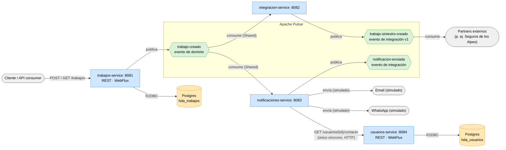

# Hogar de los Alpes — Backend de microservicios

Proyecto multi-módulo Gradle (Java 25) que implementa una porción mínima de 4 agregados
(`Trabajo`, `Usuario`, y los traductores de `integracion-service`/`notificaciones-service`),
siguiendo DDD táctico y arquitectura hexagonal, con **Spring Boot WebFlux** (reactivo),
**Apache Pulsar + Avro** como bus de eventos, y **una sola excepción síncrona explícita**
(`notificaciones-service → usuarios-service` por HTTP, una consulta de solo lectura).

## Portal web

El repositorio incluye en `frontend` una aplicación React + TypeScript que permite
crear trabajos y consultarlos por su identificador. Durante el desarrollo, redirige
`/api` a `trabajos-service` en el puerto `8081`.

```shell
cd frontend
npm install
npm run dev
```

La guía completa de ejecución, pruebas y configuración está en
[`frontend/README.md`](frontend/README.md).

## Arquitectura (vista de componentes)

Vista de alto nivel en tiempo de ejecución



- Azul: los cuatro servicios Spring Boot (procesos independientes, cada uno con su propio
  `main()` - ver `<servicio>/application`, p. ej. `backend/trabajos/application`).
- Naranja: Postgres — un solo contenedor, con **una base separada por servicio**
  (`hda_trabajos`, `hda_usuarios`; topología de datos descentralizada). `integracion-service`
  y `notificaciones-service` no persisten nada propio (solo Redis para idempotencia).
- Verde: los tópicos de Pulsar, viven dentro del broker.
- Gris: actores externos al sistema (incluye los canales simulados de notificación).
  Lo importante del diagrama: **ningún servicio le hace una llamada directa a otro, con
  una sola excepción explícita** — `notificaciones-service → usuarios-service` por HTTP,
  y es una *consulta* (no un comando): todo lo demás sigue pasando por los tópicos de
  Pulsar, que es la regla obligatoria que exige la guía (ver más abajo).

Notar el *fan-out* en `trabajo-creado`: `integracion-service` y `notificaciones-service`
tienen cada uno su propia suscripción `Shared` sobre el mismo tópico — ambos reciben
**todos** los eventos de forma independiente (no compiten entre sí por los mensajes;
eso solo pasa *dentro* de la suscripción de cada uno, si se escala a varias réplicas).
Es la forma más simple de agregar un tercer consumidor sin tocar `trabajos-service` ni
a `integracion-service` en absoluto - la evidencia de código de por qué el desacople
por eventos importa (Modificabilidad 1.1). Agregar `usuarios-service` como cuarto
componente siguió la misma lógica: ninguno de los otros tres tuvo que cambiar para que
existiera (solo `notificaciones-service`, que es quien lo consulta).

## Estructura: arquitectura limpia, 4 servicios

Cada servicio es su propia carpeta de **primer nivel** dentro de `backend/`
(`trabajos`/`integracion`/`notificaciones`/`usuarios` — el nombre corto, sin el sufijo
`-service`; ese sufijo lo siguen llevando otros identificadores que sí lo necesitan para
distinguirse de otras cosas: el nombre Spring (`spring.application.name: trabajos-service`),
la imagen Docker/ECR (`hda/trabajos-service`), el objeto Kubernetes (`Service
trabajos-service`) y el jar (`trabajos-service.jar`); la carpeta no lo necesita porque ya
está sola dentro de `backend/`). Dentro de cada una, la misma arquitectura hexagonal:
`domain/{model,usecase}` (sin dependencia de framework) e `infrastructure/{entry-points,
driven-adapters}` (adaptadores concretos) — así el árbol muestra primero el servicio y
luego la capa, al revés que el
[scaffold-clean-architecture de Bancolombia](https://github.com/bancolombia/scaffold-clean-architecture)
en el que se basó originalmente este proyecto (que pone `domain`/`infrastructure` como
carpetas de primer nivel, compartidas por todos los servicios) — el cambio se hizo para
que trabajar en un servicio no obligue a saltar entre 4 carpetas de nivel superior, y para
que un límite de módulo cruzado (p. ej. `trabajos` dependiendo de algo de `usuarios`) sea
visible de inmediato en el árbol. La regla de dependencia se cumple igual: todo apunta
hacia adentro, hacia `domain`.

Cada servicio agrega un tercer tipo de carpeta, `application/`: el módulo Gradle bootable
(el `main()`, el wiring de Spring que junta `domain`/`infrastructure` — p. ej.
`UseCasesConfig`, `PulsarConfig` — y su propio `application.yml`). Es el único punto que
conoce tanto `domain` como `infrastructure` a la vez (composition root). Antes, los cuatro
`main()` vivían juntos en un solo módulo `:applications` que dependía de los cuatro
servicios a la vez — construir cualquiera de los cuatro jars compilaba y empaquetaba los
otros tres también, y una app sin Redis (`trabajos`/`usuarios`) terminaba con las clases de
autoconfiguración de Redis en su classpath solo porque las otras dos sí lo usaban (de ahí
workarounds como `@SpringBootApplication(exclude = ...)` que ya no existen). Con
`application/` por servicio, cada uno tiene su propio classpath real: construir
`usuarios-service.jar` no toca código de `trabajos`/`integracion`/`notificaciones` en
absoluto (ver `deploy/docker-compose/Dockerfile`, un solo `ARG SERVICE` selecciona cuál).

Los nombres de proyecto Gradle sí se prefijan por servicio (`:trabajos-model`,
`:integracion-usecase`, `:notificaciones-application`, `:usuarios-model`, etc. — ver
`backend/settings.gradle`), porque ahí sí colisionarían entre sí (varios servicios tienen
un módulo `model`, un `usecase`, etc.) — es una convención de nombres Gradle, no de
carpetas.

```shell
backend/
├── eventos-shared/                      Esquemas Avro (published language) — el contrato
│                                         entre servicios, y hacia afuera. Única carpeta que
│                                         no sigue este patrón: librería plana compartida
│                                         por los cuatro servicios (shared kernel).
│
├── trabajos/
│   ├── domain/
│   │   ├── model/                       Trabajo, Moneda, CategoriaServicio, ... y los
│   │   │                                puertos (gateways/): TrabajoRepository,
│   │   │                                TrabajoEventPublisher. Cero dependencias.
│   │   └── usecase/                     CrearTrabajoUseCase, ConsultarTrabajoUseCase. Sin
│   │                                    anotaciones de Spring a propósito.
│   ├── infrastructure/
│   │   ├── entry-points/reactive-web/   TrabajoController (API HTTP, WebFlux).
│   │   └── driven-adapters/
│   │       ├── r2dbc-postgresql/        Implementa TrabajoRepository (hda_trabajos).
│   │       └── pulsar-event-bus/        Implementa TrabajoEventPublisher (Pulsar+Avro).
│   └── application/                     TrabajosServiceApplication + wiring (UseCasesConfig,
│                                         PulsarConfig) + application.yml. Módulo bootable
│                                         (`:trabajos-application`) → trabajos-service.jar.
│
├── integracion/
│   ├── domain/
│   │   ├── model/                       TrabajoCreadoEvento (entrada), TrabajoSiniestro
│   │   │                                (salida) y el puerto TrabajoSiniestroPublisher.
│   │   └── usecase/                     TraducirTrabajoCreadoUseCase.
│   ├── infrastructure/
│   │   ├── entry-points/pulsar-event-handler/  Consume trabajo-creado (driving adapter).
│   │   └── driven-adapters/
│   │       ├── pulsar-event-bus/        Implementa TrabajoSiniestroPublisher, publica
│   │       │                            trabajo-siniestro-creado.
│   │       └── redis-idempotency/       Deduplicación de eventos por id.
│   └── application/                     IntegracionServiceApplication + wiring
│                                         (UseCasesConfig, PulsarClientConfig).
│
├── notificaciones/
│   ├── domain/
│   │   ├── model/                       TrabajoCreadoEvento (entrada, con clienteId),
│   │   │                                NotificacionEnviada (salida), ContactoUsuario y los
│   │   │                                puertos CanalNotificacion (antes EmailSender,
│   │   │                                generalizado - Modificabilidad 1.1),
│   │   │                                ConsultaUsuarioGateway y NotificacionEnviadaPublisher.
│   │   └── usecase/                     EnviarNotificacionUseCase (consulta el contacto vía
│   │                                    ConsultaUsuarioGateway y dispara 0, 1 o 2 canales
│   │                                    según sus flags).
│   ├── infrastructure/
│   │   ├── entry-points/pulsar-event-handler/  Consume trabajo-creado (suscripción propia).
│   │   └── driven-adapters/
│   │       ├── pulsar-event-bus/        Implementa NotificacionEnviadaPublisher, publica
│   │       │                            notificacion-enviada.
│   │       ├── canal-notificacion/      Implementa CanalNotificacion: dos adaptadores
│   │       │                            simulados (solo loguean, sin proveedor real) -
│   │       │                            EmailChannelAdapter y WhatsAppChannelAdapter.
│   │       ├── http-client/             Implementa ConsultaUsuarioGateway (WebClient) - el
│   │       │                            único punto síncrono del sistema, hacia
│   │       │                            GET /usuarios/{clienteId}/contacto.
│   │       └── redis-idempotency/       Deduplicación de eventos por id.
│   └── application/                     NotificacionesServiceApplication + wiring
│                                         (UseCasesConfig, PulsarClientConfig).
│
├── usuarios/
│   ├── domain/
│   │   ├── model/                       Usuario (AggregateRoot<UUID>, 2 flags de canal) y el
│   │   │                                puerto UsuarioRepository. Seedwork propio, duplicado
│   │   │                                (no compartido) - mismo criterio que trabajos
│   │   │                                (integracion y notificaciones no llevan seedwork: no
│   │   │                                modelan un agregado propio).
│   │   └── usecase/                     ConsultarUsuarioUseCase.
│   ├── infrastructure/
│   │   ├── entry-points/reactive-web/   UsuarioController: único endpoint
│   │   │                                GET /usuarios/{clienteId}/contacto.
│   │   └── driven-adapters/
│   │       └── r2dbc-postgresql/        Implementa UsuarioRepository (hda_usuarios - base
│   │                                    separada, ver deploy/docker-compose/postgres-init/).
│   └── application/                     UsuariosServiceApplication + wiring (UseCasesConfig).
```

La regla obligatoria de la guía se cumple explícitamente, **con una sola excepción
documentada**: ningún servicio le llama a otro por HTTP/directo, salvo
`notificaciones-service → usuarios-service` (una consulta de solo lectura, nunca un
comando). Todo lo demás sigue el mismo patrón de Entrega 3: `trabajos-service` publica en
el tópico `trabajo-creado` de Pulsar; `integracion-service` y `notificaciones-service` lo
consumen cada uno por su lado (fan-out, ver diagrama arriba) y publican
`trabajo-siniestro-creado`/`notificacion-enviada` respectivamente. Son cuatro
procesos/servicios Spring Boot independientes, cada uno con su propio `application/`.

## Mapeo con las decisiones de diseño

| Decisión de diseño | Dónde vive en el código |
| --- | --- |
| Seedwork (Entity, ValueObject, AggregateRoot, DomainEvent) — POJOs sin dependencia de framework | `domain` (duplicado por servicio a propósito - `trabajos-service` y `usuarios-service` lo tienen cada uno el suyo, no comparten módulo) |
| Agregado raíz `Trabajo` con Factory (`Trabajo.crear(...)`) | `trabajos-service/domain/model` |
| Agregado raíz `Usuario` con Factory (`Usuario.crear(...)`) | `usuarios-service/domain/model` |
| Objeto de valor `Moneda` pensado para el escenario de modificabilidad 1.3 (nuevo país sin tocar el resto del agregado) | `domain` |
| Arquitectura hexagonal: puertos (`TrabajoRepository`, `TrabajoEventPublisher`) en el dominio vs. adaptadores concretos | `domain` (puertos) + `infrastructure` (adaptadores) |
| CQS: comando `CrearTrabajoCommand`/`CrearTrabajoUseCase` vs. consulta `ConsultarTrabajoUseCase` | `domain` y `.../consultartrabajo/` |
| Evento de dominio `TrabajoCreado` (Avro) vs. evento de integración `TrabajoSiniestroCreado` (Avro, v1) — separación exigida por el escenario 3.3 | `eventos-shared` |
| Escalabilidad (escenario 2.3): suscripción `Shared` de Pulsar en los consumidores de trabajo-creado, para poder correr varias instancias en paralelo — demo en vivo: sección "Levantarlo todo con Docker Compose" | `infrastructure` |
| Persistencia real, mínima, con topología de datos descentralizada (una base Postgres por servicio, no una tabla compartida) | `backend/{trabajos,usuarios}-service/infrastructure/driven-adapters/r2dbc-postgresql/src/main/resources/schema.sql`, `deploy/docker-compose/postgres-init/` |
| Modificabilidad (escenario 1.1): agregar un consumidor nuevo (`notificaciones-service`) sin tocar `trabajos-service` ni `integracion-service` - solo una suscripción `Shared` más sobre `trabajo-creado` | `backend/notificaciones/infrastructure/entry-points/pulsar-event-handler` |
| Modificabilidad: puerto `EmailSender` generalizado a `CanalNotificacion`; se agrega `WhatsAppChannelAdapter` sin tocar `trabajos-service`, `integracion-service` ni `usuarios-service` | `backend/notificaciones/domain/model`, `backend/notificaciones/infrastructure/driven-adapters/canal-notificacion` |
| Interoperabilidad: agregar un cuarto servicio (`usuarios-service`) la única comunicación nueva es una consulta HTTP síncrona explícita, no un comando. | `backend/notificaciones/infrastructure/driven-adapters/http-client` |
| Puerto separado para la acción real ("enviar" la notificación) vs. el evento que solo registra que ya se envió - mismo principio hexagonal que `TrabajoRepository`/`TrabajoEventPublisher` en trabajos-service | `domain` |

## Versión de Spring Boot y de Gradle

El proyecto usa **Spring Boot 4.1.1**. Esa versión de su plugin de Gradle exige
**Gradle 9.7.1 y Java 25** corriendo Gradle directamente.

## Cómo levantarlo

> **Nuevo layout de despliegue (`deploy/`).** El `docker-compose.yml`, su `Dockerfile`,
> la plantilla `.env.example` y el script `postgres-init/` se movieron a
> `deploy/docker-compose/`; los manifiestos de Kubernetes con autoescalado por KEDA están
> en `deploy/k8s/`. La guía completa de ambos flujos (Docker Compose para pruebas rápidas y
> Kubernetes + KEDA para autoescalado por backlog de Pulsar) está en
> [`deploy/README.md`](deploy/README.md). Las rutas de comandos de las secciones de abajo
> que decían `backend/docker-compose.yml` / `backend/.env` ahora viven bajo
> `deploy/docker-compose/` (p. ej. `cd deploy/docker-compose && docker compose up -d`).

> **Directorios.** Todos los comandos de esta sección se ejecutan **desde la raíz del
> repositorio** (la carpeta que contiene este `README.md`). El `docker-compose.yml`, el
> `gradlew` y el `.env` viven dentro de `backend/`, así que los comandos apuntan ahí
> explícitamente (`-f backend/...`, `--env-file backend/.env`, `./backend/gradlew`).
> Si prefieres, puedes `cd backend` una vez y omitir esos prefijos — al final de cada
> paso se indica el equivalente "desde `backend/`".

0. Credenciales por variables de entorno. Las credenciales de Postgres **no están
   hardcodeadas** en el repositorio: se leen de variables de entorno, tanto en
   `backend/docker-compose.yml` (para inicializar el contenedor) como en
   `application-trabajos.yml`/`application-usuarios.yml` (para la conexión R2DBC de cada
   servicio). Copia la plantilla versionada y ajústala con tus propios valores:

```shell
   cp backend/.env.example backend/.env
   # edita backend/.env y cambia al menos POSTGRES_PASSWORD
   ```

   El archivo `.env` real está en `.gitignore` (nunca se sube); solo se versiona la
   plantilla `.env.example`.

   | Variable | Para qué | Valor por defecto |
   | --- | --- | --- |
   | `POSTGRES_DB` | Base de datos de `trabajos-service` | `hda_trabajos` |
   | `POSTGRES_USUARIOS_DB` | Base de datos de `usuarios-service` | `hda_usuarios` |
   | `POSTGRES_USER` | Usuario de Postgres | `hda` |
   | `POSTGRES_PASSWORD` | Contraseña de Postgres | `changeit` (¡cámbiala!) |
   | `POSTGRES_HOST` | Host al que se conectan `trabajos-service`/`usuarios-service` | `localhost` |
   | `POSTGRES_PORT` | Puerto de Postgres | `5432` |

   Si no defines nada, aplican los valores por defecto (pensados solo para desarrollo
   local). Si arrancas un servicio **fuera** de Docker Compose (con `java -jar`), exporta
   las variables en esa terminal para que las lea la app.

   > **`hda_usuarios` solo se crea en un volumen nuevo de Postgres.** El script
   > `backend/docker/postgres-init/01-create-usuarios-db.sh` corre automáticamente la
   > primera vez que se inicializa el volumen `pgdata` (Postgres solo ejecuta
   > `docker-entrypoint-initdb.d` en un volumen vacío). Si ya tenías el contenedor de una
   > sesión anterior a que existiera `usuarios-service`, hay que recrear el volumen una
   > vez para que se aplique:
   > ```shell
   > docker compose --env-file backend/.env -f backend/docker-compose.yml down -v
   > docker compose --env-file backend/.env -f backend/docker-compose.yml up -d
   > ```
   > (`down -v` borra los datos de **ambas** bases en ese volumen - solo son datos de
   > prueba locales, no hay nada que perder en desarrollo.)

1. Infraestructura: levanta Postgres (`5432`), Pulsar (`6650`/`8080`) y Redis (`6379`).
   Redis lo usan `integracion-service` y `notificaciones-service` como almacén de
   idempotencia (deduplicación de eventos por su `id`).

```shell
   docker compose --env-file backend/.env -f backend/docker-compose.yml up -d
   ```

   > **Importante al ejecutar desde la raíz:** hay que pasar **ambos**
   > `--env-file backend/.env` **y** `-f backend/docker-compose.yml`. Docker Compose busca
   > el `.env` en el directorio actual (la raíz), no junto al `docker-compose.yml`; sin
   > `--env-file` usaría los valores por defecto en vez de los de tu `.env`.
   >
   > Equivalente desde `backend/`: `cd backend && docker compose up -d` (ahí Compose lee
   > `.env` automáticamente).

2. Crear el tenant y los namespaces de Pulsar que usan los tópicos de este proyecto:

```shell
   docker exec hda-pulsar bin/pulsar-admin tenants create hda
   docker exec hda-pulsar bin/pulsar-admin namespaces create hda/trabajos
   docker exec hda-pulsar bin/pulsar-admin namespaces create hda/integracion
   docker exec hda-pulsar bin/pulsar-admin namespaces create hda/notificaciones
   ```

   (Estos usan `docker exec` sobre el contenedor `hda-pulsar`, así que funcionan igual
   desde cualquier directorio.)

3. Compilar los cuatro servicios. Cada uno es su propio módulo Gradle bootable (con su
   propio classpath y su propio `build/libs/`), así que se pueden compilar juntos o por
   separado sin que uno afecte al otro:

```shell
./backend/gradlew -p backend :trabajos-application:bootJar :integracion-application:bootJar :notificaciones-application:bootJar :usuarios-application:bootJar
```

   (o compilar todo el proyecto de una vez: `./backend/gradlew -p backend build`.)

3.1. Correr cada servicio (cada uno en su propia terminal):
    - `usuarios-service` (`com.hda.usuarios.UsuariosServiceApplication`) → puerto `8084`.
      **Arráncalo antes que `notificaciones-service`** - es a quien le consulta el
      contacto de cada cliente (único punto síncrono del sistema).

```shell
java -jar backend/usuarios/application/build/libs/usuarios-service.jar
```

- `trabajos-service` (`com.hda.trabajos.TrabajosServiceApplication`) → puerto `8081`.

```shell
java -jar backend/trabajos/application/build/libs/trabajos-service.jar
```

- `integracion-service` (`com.hda.integracion.IntegracionServiceApplication`) →
  puerto `8082`.

```shell
java -jar backend/integracion/application/build/libs/integracion-service.jar
```

- `notificaciones-service` (`com.hda.notificaciones.NotificacionesServiceApplication`) →
  puerto `8083`.

```shell
java -jar backend/notificaciones/application/build/libs/notificaciones-service.jar
```

4. `usuarios-service` viene con 3 usuarios semilla (UUID fijo, ver
   `backend/usuarios/infrastructure/driven-adapters/r2dbc-postgresql/src/main/resources/usuarios/schema.sql`),
   pensados justo para probar los 3 casos de canal:

   | `clienteId` | Canal |
   | --- | --- |
   | `11111111-1111-1111-1111-111111111111` | Solo email |
   | `11111111-1111-1111-1111-111111111112` | Solo WhatsApp |
   | `11111111-1111-1111-1111-111111111113` | Ambos |
   | `11111111-1111-1111-1111-111111111114` | Solo email |

   Se pueden consultar directamente, sin pasar por `trabajos-service`:

```shell
curl http://localhost:8084/usuarios/11111111-1111-1111-1111-111111111111/contacto
```

5. Probar el flujo completo, una vez por cada `clienteId` de la tabla anterior:

```shell
curl -X POST http://localhost:8081/trabajos \
-H 'Content-Type: application/json' \
-d '{"clienteId": "11111111-1111-1111-1111-111111111111", "categoriaServicio": "plomeria", "urgencia": "ALTA", "ciudad": "Bogota", "origen": "MARKETPLACE", "partnerId": null, "moneda": "COP"}'
```

Esto crea el `Trabajo`, lo persiste, y publica `TrabajoCreado` en Pulsar.
`integracion-service` y `notificaciones-service` lo consumen cada uno por su lado
(fan-out): el primero publica `TrabajoSiniestroCreado`; el segundo consulta el contacto
del `clienteId` en `usuarios-service` (único punto síncrono) y "envía" (simulado, solo lo
loguea) por el canal que corresponda según sus flags, publicando un `NotificacionEnviada`
por cada canal. Con los 3 `clienteId` de la tabla anterior, el log de
`notificaciones-service` debería mostrar exactamente:
- Usuario A → solo `[EMAIL SIMULADO] Para: usuarioA@hda.test ...`
- Usuario B → solo `[WHATSAPP SIMULADO] Para: +57 300 0000002 ...`
- Usuario C → ambos logs (dos eventos `NotificacionEnviada`, uno por canal)
- Usuario D → solo `[EMAIL SIMULADO] Para: usuarioD@hda.test ...`

La respuesta trae el `id` generado (UUID), por ejemplo:

```json
{"id":"a63f8965-6b70-4e2b-bf01-0636401287a2","clienteId":"11111111-1111-1111-1111-111111111111","categoriaServicio":"plomeria","urgencia":"ALTA","ciudad":"Bogota","origen":"MARKETPLACE","partnerId":null,"moneda":"COP","estado":"CREADO","fechaCreacion":"2026-09-06T05:56:25.688907Z"}
```

Consulta (reemplaza `<id>` por el `id` de la respuesta anterior - `{id}` tal
cual, sin reemplazar, no es un id válido y da `400 Bad Request`):

```shell
curl http://localhost:8081/trabajos/<id>
```

## Cómo inspeccionar Postgres y Pulsar directamente

Util para confirmar que un `POST /trabajos` realmente persistió y publicó el evento,
sin depender solo de la respuesta HTTP.

### Postgres (la tabla `trabajo`)

Sesión interactiva:

```shell
docker exec -it hda-postgres psql -U hda -d hda_trabajos
```

Dentro: `\dt` lista las tablas, `select * from trabajo;` muestra las filas, `\q` sale.
O en un solo comando, sin entrar a la sesión interactiva:

```shell
docker exec hda-postgres psql -U hda -d hda_trabajos \
-c "select id, cliente_id, categoria_servicio, ciudad, estado, fecha_creacion from trabajo;"
```

### Postgres (la tabla `usuario`, base separada `hda_usuarios`)

```shell
docker exec hda-postgres psql -U hda -d hda_usuarios \
-c "select id, nombre, notificar_por_email, notificar_por_whatsapp from usuario;"
```

Deben aparecer los 3 usuarios semilla (ver tabla de `clienteId` más arriba) - si esta base
no existe todavía, ver la nota sobre `docker-entrypoint-initdb.d` en el paso 0.

### Pulsar (los eventos publicados)

Ver cuántos mensajes se han publicado por tópico, sin consumirlos (no interfiere con
las suscripciones reales de `integracion-service`/`notificaciones-service`):

```shell
docker exec hda-pulsar bin/pulsar-admin topics stats persistent://hda/trabajos/trabajo-creado
docker exec hda-pulsar bin/pulsar-admin topics stats persistent://hda/integracion/trabajo-siniestro-creado
docker exec hda-pulsar bin/pulsar-admin topics stats persistent://hda/notificaciones/notificacion-enviada
```

Fijarse en `msgInCounter` (total publicado desde que existe el tópico). Los últimos dos
tópicos recién se crean (y el comando recién responde) cuando `integracion-service`/
`notificaciones-service` han corrido y procesado al menos un `TrabajoCreado` cada uno -
antes de eso dan "Topic ... not found".

Ver el contenido de los últimos mensajes (tampoco consume/hace ack, así que no afecta
las suscripciones reales):

```shell
docker exec hda-pulsar bin/pulsar-admin topics peek-messages \
persistent://hda/trabajos/trabajo-creado -s inspeccion -n 5
```

**Ver los eventos en vivo, a medida que van llegando** (una terminal que se queda
abierta, en vez de mirar mensajes ya publicados): `bin/pulsar-client consume` con
`-n 0` (consumir para siempre) y `-st auto_consume` (decodifica el Avro a texto
legible en vez de bytes crudos):

```shell
# Terminal 1: eventos de dominio (los publica trabajos-service)
docker exec -it hda-pulsar bin/pulsar-client consume persistent://hda/trabajos/trabajo-creado \
-s watch-trabajo-creado -n 0 -p Latest -st auto_consume

# Terminal 2: eventos de integración hacia partners (los publica integracion-service)
docker exec -it hda-pulsar bin/pulsar-client consume persistent://hda/integracion/trabajo-siniestro-creado \
-s watch-trabajo-siniestro -n 0 -p Latest -st auto_consume

# Terminal 3: eventos de notificación enviada (los publica notificaciones-service)
docker exec -it hda-pulsar bin/pulsar-client consume persistent://hda/notificaciones/notificacion-enviada \
-s watch-notificacion-enviada -n 0 -p Latest -st auto_consume
```
