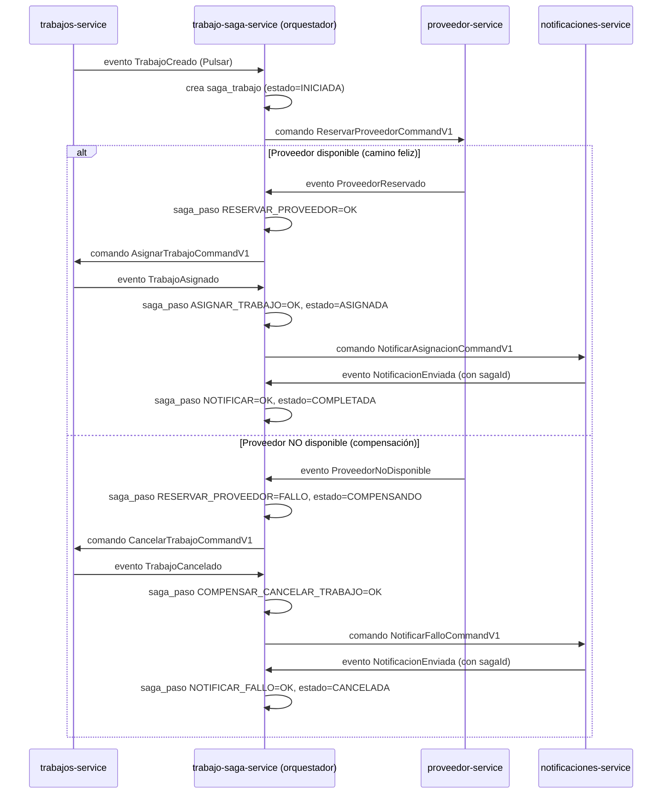

# Hogar de los Alpes — Backend de microservicios

Proyecto multi-módulo Gradle (Java 25) que implementa una porción mínima de varios
agregados (`Trabajo`, `Usuario`, `Proveedor`, `SagaTrabajo`, y los traductores de
`integracion-service`/`notificaciones-service`), siguiendo DDD táctico y arquitectura
hexagonal, con **Spring Boot WebFlux** (reactivo), **Apache Pulsar + Avro** como bus de
eventos, y **una sola excepción síncrona explícita** (`notificaciones-service →
usuarios-service` por HTTP, una consulta de solo lectura).

Desde la Entrega 5, el sistema tiene **6 servicios de negocio y un BFF**: los 4 de la Entrega 4
(`trabajos`/`integracion`/`notificaciones`/`usuarios`) más `proveedor-service` y
`trabajo-saga-service`, que implementan la saga de **orquestación** "Asignación de
trabajo con proveedor" (ver sección [Saga: "Asignación de trabajo con
proveedor"](#saga-asignación-de-trabajo-con-proveedor) más abajo). `bff-service` es el
único punto de entrada HTTP público: delega comandos y compone consultas, pero no contiene
reglas de dominio ni coordina la saga.

## API pública (BFF)

**Despliegue académico verificado:**
[https://hda-entrega5-bff-5gr56g469x67h45wp-8090.app.github.dev](https://hda-entrega5-bff-5gr56g469x67h45wp-8090.app.github.dev)
(disponible mientras el Codespace esté encendido; consulte el
[registro de despliegue](docs/deployment/ENTREGA.md)).

| Operación | Ruta |
| --- | --- |
| Salud | `GET /actuator/health` |
| Crear trabajo | `POST /api/v1/trabajos` |
| Consultar trabajo | `GET /api/v1/trabajos/{trabajoId}` |
| Consultar trabajo y saga | `GET /api/v1/trabajos/{trabajoId}/seguimiento` |
| Consultar Saga Log | `GET /api/v1/sagas/{sagaId}` |

- Contrato OpenAPI: [`docs/api/openapi.yaml`](docs/api/openapi.yaml).
- Colección Postman: [`docs/postman`](docs/postman/README.md).
- Despliegue demostrable sin costo: [`deploy/codespaces`](deploy/codespaces/README.md).
- Despliegue AWS con costo (alternativo): [`deploy/k8s-cloud`](deploy/k8s-cloud/README.md).
- Registro de evidencia: [`docs/deployment/ENTREGA.md`](docs/deployment/ENTREGA.md).

## Portal web

El repositorio incluye en `frontend` una aplicación React + TypeScript que permite
crear trabajos y consultarlos por su identificador. Durante el desarrollo, redirige
`/api` al BFF en `http://localhost:8090`.

```shell
cd frontend
npm install
npm run dev
```

La guía completa de ejecución, pruebas y configuración está en
[`frontend/README.md`](frontend/README.md).

## Arquitectura (vista de componentes)

Vista de alto nivel en tiempo de ejecución

```mermaid
graph LR
    Cliente(["Cliente / API consumer"])
    Externos(["Partners externos<br/>(p. ej. Seguros de los Alpes)"])
    Email(["Email (simulado)"])
    WhatsApp(["WhatsApp (simulado)"])
    Tutor(["Tutor / API consumer"])

    BFF["bff-service :8080<br/>API público · WebFlux"]
    Trabajos["trabajos-service :8081<br/>REST · WebFlux"]
    Integracion["integracion-service :8082"]
    Notificaciones["notificaciones-service :8083"]
    Usuarios["usuarios-service :8084<br/>REST · WebFlux"]
    Proveedor["proveedor-service :8085"]
    TrabajoSaga["trabajo-saga-service :8086<br/>REST · WebFlux (Saga Log)"]

    DBTrabajos[("Postgres<br/>hda_trabajos")]
    DBUsuarios[("Postgres<br/>hda_usuarios")]
    DBProveedor[("Postgres<br/>hda_proveedor")]
    DBTrabajoSaga[("Postgres<br/>hda_trabajo_saga")]

    subgraph Pulsar["Apache Pulsar"]
        TopicCreado{{"trabajo-creado<br/>evento de dominio"}}
        TopicSiniestro{{"trabajo-siniestro-creado<br/>evento de integración v1"}}
        TopicNotificacion{{"notificacion-enviada<br/>evento de integración<br/>(sagaId opcional)"}}
        ComandosSaga{{"comandos de la saga<br/>(trabajo-saga-service → participantes)"}}
        EventosSaga{{"eventos resultado<br/>(participantes → trabajo-saga-service)"}}
    end

    Cliente -->|"/api/v1"| BFF
    Tutor -->|"/api/v1"| BFF
    BFF -->|"comando y consulta"| Trabajos
    BFF -->|"consulta Saga Log"| TrabajoSaga
    Trabajos -->|R2DBC| DBTrabajos
    Trabajos -->|publica| TopicCreado
    TopicCreado -->|"consume (Shared)"| Integracion
    TopicCreado -->|"consume (Shared)"| Notificaciones
    TopicCreado -->|"consume (Shared)"| TrabajoSaga
    Integracion -->|publica| TopicSiniestro
    TopicSiniestro -->|consume| Externos
    Notificaciones -->|"GET /usuarios/{id}/contacto<br/>(único síncrono, HTTP)"| Usuarios
    Usuarios -->|R2DBC| DBUsuarios
    Notificaciones -->|"envía (simulado)"| Email
    Notificaciones -->|"envía (simulado)"| WhatsApp
    Notificaciones -->|publica| TopicNotificacion
    TopicNotificacion -->|"consume (sagaId presente)"| TrabajoSaga

    TrabajoSaga -->|publica| ComandosSaga
    ComandosSaga -->|"consume: reservar/liberar"| Proveedor
    ComandosSaga -->|"consume: asignar/cancelar"| Trabajos
    ComandosSaga -->|"consume: notificar"| Notificaciones
    Proveedor -->|publica| EventosSaga
    Trabajos -->|publica| EventosSaga
    EventosSaga -->|"consume (Shared)"| TrabajoSaga
    Proveedor -->|R2DBC| DBProveedor
    TrabajoSaga -->|R2DBC| DBTrabajoSaga

    classDef servicio fill:#cfe8ff,stroke:#4a90d9,color:#000000;
    classDef infra fill:#ffe8b3,stroke:#d9a441,color:#000000;
    classDef topic fill:#d9f2d9,stroke:#4aa64a,color:#000000;
    classDef externo fill:#f0f0f0,stroke:#999999,color:#000000;

    class BFF,Trabajos,Integracion,Notificaciones,Usuarios,Proveedor,TrabajoSaga servicio;
    class DBTrabajos,DBUsuarios,DBProveedor,DBTrabajoSaga infra;
    class TopicCreado,TopicSiniestro,TopicNotificacion,ComandosSaga,EventosSaga topic;
    class Cliente,Externos,Email,WhatsApp,Tutor externo;
```



- Azul: seis servicios de negocio y el BFF como procesos Spring Boot independientes. El
  BFF es un adaptador de presentación y no un séptimo contexto de dominio.
- Naranja: Postgres — un solo contenedor, con **una base separada por servicio**
  (`hda_trabajos`, `hda_usuarios`, `hda_proveedor`, `hda_trabajo_saga`; topología de datos
  descentralizada). `integracion-service` y `notificaciones-service` no persisten nada
  propio (solo Redis para idempotencia).
- Verde: los tópicos de Pulsar, viven dentro del broker. `ComandosSaga`/`EventosSaga` son
  una simplificación del diagrama: en realidad son **9 tópicos distintos** (uno por cada
  comando/evento de la sección 2.4 del plan de Entrega 5), cada uno bajo el namespace del
  servicio que lo consume (comandos) o lo publica (eventos) — nunca uno propio de
  `trabajo-saga-service` (ver [Saga: "Asignación de trabajo con
  proveedor"](#saga-asignación-de-trabajo-con-proveedor)).
- Gris: actores externos al sistema (incluye los canales simulados de notificación).
  Entre servicios de negocio existe **una sola excepción síncrona explícita**:
  `notificaciones-service → usuarios-service` por HTTP y únicamente para consulta. Las
  llamadas del BFF a Trabajos y Saga pertenecen al borde de presentación; la colaboración
  de dominio y la transacción larga siguen pasando por eventos de Pulsar.

Notar el *fan-out* en `trabajo-creado`: `integracion-service` y `notificaciones-service`
tienen cada uno su propia suscripción `Shared` sobre el mismo tópico — ambos reciben
**todos** los eventos de forma independiente (no compiten entre sí por los mensajes;
eso solo pasa *dentro* de la suscripción de cada uno, si se escala a varias réplicas).
Es la forma más simple de agregar un tercer consumidor sin tocar `trabajos-service` ni
a `integracion-service` en absoluto - la evidencia de código de por qué el desacople
por eventos importa (Modificabilidad 1.1). Agregar `usuarios-service` como cuarto
componente siguió la misma lógica: ninguno de los otros tres tuvo que cambiar para que
existiera (solo `notificaciones-service`, que es quien lo consulta).

## Estructura: arquitectura limpia, 6 servicios de negocio + BFF

Cada servicio es su propia carpeta de **primer nivel** dentro de `backend/`
(`trabajos`/`integracion`/`notificaciones`/`usuarios`/`proveedor`/`trabajo-saga` — el nombre corto, sin el sufijo
`-service`; ese sufijo lo siguen llevando otros identificadores que sí lo necesitan para
distinguirse de otras cosas: el nombre Spring (`spring.application.name: trabajos-service`),
la imagen Docker/ECR (`hda/trabajos-service`), el objeto Kubernetes (`Service
trabajos-service`) y el jar (`trabajos-service.jar`); la carpeta no lo necesita porque ya
está sola dentro de `backend/`). Dentro de cada una, la misma arquitectura hexagonal:
`domain/{model,usecase}` (sin dependencia de framework) e `infrastructure/{entry-points,
driven-adapters}` (adaptadores concretos) — así el árbol muestra primero el servicio y
luego la capa, al revés que el
[scaffold-clean-architecture de Bancolombia](https://github.com/bancolombia/scaffold-clean-architecture)
en el que se basó originalmente este proyecto (que pone `domain`/`infrastructure` como
carpetas de primer nivel, compartidas por todos los servicios) — el cambio se hizo para
que trabajar en un servicio no obligue a saltar entre 4 carpetas de nivel superior, y para
que un límite de módulo cruzado (p. ej. `trabajos` dependiendo de algo de `usuarios`) sea
visible de inmediato en el árbol. La regla de dependencia se cumple igual: todo apunta
hacia adentro, hacia `domain`.

Cada servicio agrega un tercer tipo de carpeta, `application/`: el módulo Gradle bootable
(el `main()`, el wiring de Spring que junta `domain`/`infrastructure` — p. ej.
`UseCasesConfig`, `PulsarConfig` — y su propio `application.yml`). Es el único punto que
conoce tanto `domain` como `infrastructure` a la vez (composition root). Antes, los cuatro
`main()` vivían juntos en un solo módulo `:applications` que dependía de los cuatro
servicios a la vez — construir cualquiera de los cuatro jars compilaba y empaquetaba los
otros tres también, y una app sin Redis (`trabajos`/`usuarios`) terminaba con las clases de
autoconfiguración de Redis en su classpath solo porque las otras dos sí lo usaban (de ahí
workarounds como `@SpringBootApplication(exclude = ...)` que ya no existen). Con
`application/` por servicio, cada uno tiene su propio classpath real: construir
`usuarios-service.jar` no toca código de `trabajos`/`integracion`/`notificaciones` en
absoluto (ver `deploy/docker-compose/Dockerfile`, un solo `ARG SERVICE` selecciona cuál).

Los nombres de proyecto Gradle sí se prefijan por servicio (`:trabajos-model`,
`:integracion-usecase`, `:notificaciones-application`, `:usuarios-model`, etc. — ver
`backend/settings.gradle`), porque ahí sí colisionarían entre sí (varios servicios tienen
un módulo `model`, un `usecase`, etc.) — es una convención de nombres Gradle, no de
carpetas.

```shell
backend/
├── eventos-shared/                      Esquemas Avro (published language) — el contrato
│                                         entre servicios, y hacia afuera. Única carpeta que
│                                         no sigue este patrón: librería plana compartida
│                                         por los seis servicios (shared kernel).
│
├── trabajos/
│   ├── domain/
│   │   ├── model/                       Trabajo, Moneda, CategoriaServicio, ... y los
│   │   │                                puertos (gateways/): TrabajoRepository,
│   │   │                                TrabajoEventPublisher. Cero dependencias.
│   │   └── usecase/                     CrearTrabajoUseCase, ConsultarTrabajoUseCase. Sin
│   │                                    anotaciones de Spring a propósito.
│   ├── infrastructure/
│   │   ├── entry-points/reactive-web/   TrabajoController (API HTTP, WebFlux).
│   │   └── driven-adapters/
│   │       ├── r2dbc-postgresql/        Implementa TrabajoRepository (hda_trabajos).
│   │       └── pulsar-event-bus/        Implementa TrabajoEventPublisher (Pulsar+Avro).
│   └── application/                     TrabajosServiceApplication + wiring (UseCasesConfig,
│                                         PulsarConfig) + application.yml. Módulo bootable
│                                         (`:trabajos-application`) → trabajos-service.jar.
│
├── integracion/
│   ├── domain/
│   │   ├── model/                       TrabajoCreadoEvento (entrada), TrabajoSiniestro
│   │   │                                (salida) y el puerto TrabajoSiniestroPublisher.
│   │   └── usecase/                     TraducirTrabajoCreadoUseCase.
│   ├── infrastructure/
│   │   ├── entry-points/pulsar-event-handler/  Consume trabajo-creado (driving adapter).
│   │   └── driven-adapters/
│   │       ├── pulsar-event-bus/        Implementa TrabajoSiniestroPublisher, publica
│   │       │                            trabajo-siniestro-creado.
│   │       └── redis-idempotency/       Deduplicación de eventos por id.
│   └── application/                     IntegracionServiceApplication + wiring
│                                         (UseCasesConfig, PulsarClientConfig).
│
├── notificaciones/
│   ├── domain/
│   │   ├── model/                       TrabajoCreadoEvento (entrada, con clienteId),
│   │   │                                NotificacionEnviada (salida), ContactoUsuario y los
│   │   │                                puertos CanalNotificacion (antes EmailSender,
│   │   │                                generalizado - Modificabilidad 1.1),
│   │   │                                ConsultaUsuarioGateway y NotificacionEnviadaPublisher.
│   │   └── usecase/                     EnviarNotificacionUseCase (consulta el contacto vía
│   │                                    ConsultaUsuarioGateway y dispara 0, 1 o 2 canales
│   │                                    según sus flags).
│   ├── infrastructure/
│   │   ├── entry-points/pulsar-event-handler/  Consume trabajo-creado (suscripción propia).
│   │   └── driven-adapters/
│   │       ├── pulsar-event-bus/        Implementa NotificacionEnviadaPublisher, publica
│   │       │                            notificacion-enviada.
│   │       ├── canal-notificacion/      Implementa CanalNotificacion: dos adaptadores
│   │       │                            simulados (solo loguean, sin proveedor real) -
│   │       │                            EmailChannelAdapter y WhatsAppChannelAdapter.
│   │       ├── http-client/             Implementa ConsultaUsuarioGateway (WebClient) - el
│   │       │                            único punto síncrono del sistema, hacia
│   │       │                            GET /usuarios/{clienteId}/contacto.
│   │       └── redis-idempotency/       Deduplicación de eventos por id.
│   └── application/                     NotificacionesServiceApplication + wiring
│                                         (UseCasesConfig, PulsarClientConfig).
│
├── usuarios/
│   ├── domain/
│   │   ├── model/                       Usuario (AggregateRoot<UUID>, 2 flags de canal) y el
│   │   │                                puerto UsuarioRepository. Seedwork propio, duplicado
│   │   │                                (no compartido) - mismo criterio que trabajos
│   │   │                                (integracion y notificaciones no llevan seedwork: no
│   │   │                                modelan un agregado propio).
│   │   └── usecase/                     ConsultarUsuarioUseCase.
│   ├── infrastructure/
│   │   ├── entry-points/reactive-web/   UsuarioController: único endpoint
│   │   │                                GET /usuarios/{clienteId}/contacto.
│   │   └── driven-adapters/
│   │       └── r2dbc-postgresql/        Implementa UsuarioRepository (hda_usuarios - base
│   │                                    separada, ver deploy/docker-compose/postgres-init/).
│   └── application/                     UsuariosServiceApplication + wiring (UseCasesConfig).
│
├── proveedor/                            Nuevo en Entrega 5. Agregado Proveedor: la
│                                         reserva/liberación es un UPDATE atómico a nivel de
│                                         SQL, no un ciclo cargar-mutar-guardar (ver Saga Log
│                                         más abajo - hallazgo del paso 9 de la verificación).
│   ├── domain/
│   │   ├── model/                       Proveedor (AggregateRoot<UUID>, datos semilla - no
│   │   │                                se crea desde la app) y los puertos
│   │   │                                ProveedorRepository, ProveedorEventPublisher.
│   │   └── usecase/                     ReservarProveedorUseCase, LiberarProveedorUseCase
│   │                                    (esta última no se ejercita en el camino de fallo de
│   │                                    esta entrega, pero está implementada de verdad).
│   ├── infrastructure/
│   │   ├── entry-points/pulsar-command-handler/  Consume ReservarProveedorCommandV1 y
│   │   │                                LiberarProveedorCommandV1.
│   │   └── driven-adapters/
│   │       ├── r2dbc-postgresql/        Implementa ProveedorRepository (hda_proveedor):
│   │       │                            reserva atómica UPDATE...RETURNING, comparación
│   │       │                            insensible a mayúsculas/tildes (TRANSLATE nativo).
│   │       └── pulsar-event-bus/        Implementa ProveedorEventPublisher: publica
│   │                                    ProveedorReservado/NoDisponible/Liberado.
│   └── application/                     ProveedorServiceApplication + wiring. Puerto 8085.
│
├── trabajo-saga/                         Nuevo en Entrega 5. El orquestador — máquina de
│                                         estados explícita de la saga (ver sección dedicada
│                                         más abajo). Paquete base com.hda.trabajosaga.
│   ├── domain/
│   │   ├── model/                       SagaTrabajo (AggregateRoot<UUID> — su id ES el
│   │   │                                sagaId), PasoSaga/PasoSagaTipo/EstadoSaga, y los
│   │   │                                puertos SagaTrabajoRepository/SagaTrabajoEventPublisher.
│   │   └── usecase/                     OrquestarSagaTrabajoUseCase (un método por cada uno
│   │                                    de los 6 eventos que orquesta) y
│   │                                    ConsultarSagaTrabajoUseCase.
│   ├── infrastructure/
│   │   ├── entry-points/
│   │   │   ├── reactive-web/            SagaTrabajoController: GET /sagas/trabajos/{trabajoId}
│   │   │   │                            y GET /sagas/{sagaId}.
│   │   │   └── pulsar-event-handler/    6 listeners (TrabajoCreado, ProveedorReservado,
│   │   │                                ProveedorNoDisponible, TrabajoAsignado,
│   │   │                                TrabajoCancelado, NotificacionEnviada).
│   │   └── driven-adapters/
│   │       ├── r2dbc-postgresql/        Implementa SagaTrabajoRepository (hda_trabajo_saga,
│   │       │                            el Saga Log): upsert atómico de saga_trabajo (INSERT
│   │       │                            ... ON CONFLICT), inserts de saga_paso protegidos por
│   │       │                            UNIQUE(saga_id, paso).
│   │       └── pulsar-event-bus/        Implementa SagaTrabajoEventPublisher: publica los 5
│   │                                    comandos hacia proveedor/trabajos/notificaciones.
│   └── application/                     TrabajoSagaServiceApplication + wiring. Puerto 8086.
│
└── bff/
    └── application/                     Adaptador de presentación WebFlux. Expone el API
                                          público, propaga X-Correlation-Id y compone las
                                          consultas de Trabajo + Saga Log. No contiene
                                          entidades ni reglas de dominio. Puerto 8080.
```

La regla obligatoria de la guía se cumple explícitamente, **con una sola excepción
documentada**: ningún servicio le llama a otro por HTTP/directo, salvo
`notificaciones-service → usuarios-service` (una consulta de solo lectura, nunca un
comando). Todo lo demás sigue el mismo patrón de Entrega 3: `trabajos-service` publica en
el tópico `trabajo-creado` de Pulsar; `integracion-service` y `notificaciones-service` lo
consumen cada uno por su lado (fan-out, ver diagrama arriba) y publican
`trabajo-siniestro-creado`/`notificacion-enviada` respectivamente. `proveedor-service` y
`trabajo-saga-service` (Entrega 5) siguen el mismo patrón, agregando comandos dirigidos
(saga → participante) además de eventos — ver [Saga: "Asignación de trabajo con
proveedor"](#saga-asignación-de-trabajo-con-proveedor). Son siete procesos/servicios Spring
Boot independientes, cada uno con su propio `application/`.

## Mapeo con las decisiones de diseño

| Decisión de diseño | Dónde vive en el código |
| --- | --- |
| Seedwork (Entity, ValueObject, AggregateRoot, DomainEvent) — POJOs sin dependencia de framework | `domain` (duplicado por servicio a propósito - `trabajos-service` y `usuarios-service` lo tienen cada uno el suyo, no comparten módulo) |
| Agregado raíz `Trabajo` con Factory (`Trabajo.crear(...)`) | `trabajos-service/domain/model` |
| Agregado raíz `Usuario` con Factory (`Usuario.crear(...)`) | `usuarios-service/domain/model` |
| Objeto de valor `Moneda` pensado para el escenario de modificabilidad 1.3 (nuevo país sin tocar el resto del agregado) | `domain` |
| Arquitectura hexagonal: puertos (`TrabajoRepository`, `TrabajoEventPublisher`) en el dominio vs. adaptadores concretos | `domain` (puertos) + `infrastructure` (adaptadores) |
| CQS: comando `CrearTrabajoCommand`/`CrearTrabajoUseCase` vs. consulta `ConsultarTrabajoUseCase` | `domain` y `.../consultartrabajo/` |
| Evento de dominio `TrabajoCreado` (Avro) vs. evento de integración `TrabajoSiniestroCreado` (Avro, v1) — separación exigida por el escenario 3.3 | `eventos-shared` |
| Escalabilidad (escenario 2.3): suscripción `Shared` de Pulsar en los consumidores de trabajo-creado, para poder correr varias instancias en paralelo — demo en vivo: sección "Levantarlo todo con Docker Compose" | `infrastructure` |
| Persistencia real, mínima, con topología de datos descentralizada (una base Postgres por servicio, no una tabla compartida) | `backend/{trabajos,usuarios}-service/infrastructure/driven-adapters/r2dbc-postgresql/src/main/resources/schema.sql`, `deploy/docker-compose/postgres-init/` |
| Modificabilidad (escenario 1.1): agregar un consumidor nuevo (`notificaciones-service`) sin tocar `trabajos-service` ni `integracion-service` - solo una suscripción `Shared` más sobre `trabajo-creado` | `backend/notificaciones/infrastructure/entry-points/pulsar-event-handler` |
| Modificabilidad: puerto `EmailSender` generalizado a `CanalNotificacion`; se agrega `WhatsAppChannelAdapter` sin tocar `trabajos-service`, `integracion-service` ni `usuarios-service` | `backend/notificaciones/domain/model`, `backend/notificaciones/infrastructure/driven-adapters/canal-notificacion` |
| Interoperabilidad: agregar un cuarto servicio (`usuarios-service`) la única comunicación nueva es una consulta HTTP síncrona explícita, no un comando. | `backend/notificaciones/infrastructure/driven-adapters/http-client` |
| Puerto separado para la acción real ("enviar" la notificación) vs. el evento que solo registra que ya se envió - mismo principio hexagonal que `TrabajoRepository`/`TrabajoEventPublisher` en trabajos-service | `domain` |
| **Entrega 5** — Orquestador dedicado (`trabajo-saga-service`), no genérico: acotado a UNA transacción larga para evitar convertirse en "God Service" — otra transacción larga futura se modelaría como OTRO orquestador, nunca agregada a este | `backend/trabajo-saga` |
| Saga Log (`saga_trabajo`/`saga_paso`) como fuente de verdad del estado de la saga y store de idempotencia (sin infraestructura adicional) | `backend/trabajo-saga/infrastructure/driven-adapters/r2dbc-postgresql/src/main/resources/trabajosaga/schema.sql` |
| Compensación explícita: `Trabajo.cancelar(sagaId)`/`Proveedor.liberar(sagaId)`, idempotentes por guardas del propio agregado (mismo principio que `Trabajo.asignar(sagaId)`) | `backend/trabajos/domain/model`, `backend/proveedor/domain/model` |
| Reserva de un recurso compartido y contendido (`Proveedor`) como UPDATE atómico (`WHERE disponible = TRUE ... RETURNING`), no como ciclo cargar-mutar-guardar — evita una carrera de lectura-decisión-escritura entre ejecuciones concurrentes del mismo comando (hallazgo real de la verificación de idempotencia, paso 9) | `backend/proveedor/infrastructure/driven-adapters/r2dbc-postgresql/ProveedorR2dbcRepository` |

## Saga: "Asignación de trabajo con proveedor"

Entrega 5 agrega la primera transacción larga del sistema: hoy un `Trabajo` se crea pero
nunca se le asigna un proveedor. La saga cierra ese hueco, reutilizando el agregado
`Proveedor` (documentado desde la Entrega 2, nunca implementado) y los estados
`ASIGNADO`/`CANCELADO` de `EstadoTrabajo` (definidos desde la Entrega 3, nunca usados).



Único camino de fallo/compensación implementado: "proveedor no disponible" — alcanza para
demostrar tanto la transacción exitosa como la compensada, sin multiplicar la superficie de
prueba. Demo determinista (ver semilla en `backend/proveedor/.../schema.sql`): un `Trabajo`
`plomeria`/`Bogota` sigue el camino feliz (existe `Proveedor X`); uno `plomeria`/`Medellin`
dispara la compensación (no hay ningún proveedor ahí).

### Por qué esto es orquestación aunque todo viaje por eventos

La distinción orquestación/coreografía **no depende de si la comunicación es síncrona o
asíncrona** — depende de **dónde vive el conocimiento de "qué sigue"**. Aquí, un único
componente (`trabajo-saga-service`) conoce el proceso completo como una máquina de estados
explícita (`OrquestarSagaTrabajoUseCase`, `backend/trabajo-saga/domain/model/SagaTrabajo.java`).
`trabajos-service`, `proveedor-service` y `notificaciones-service` **no saben que están en
una saga**: solo reciben un comando, ejecutan su transacción local, y devuelven un evento de
resultado — la regla "si no hay proveedor, cancela y notifica el fallo" vive únicamente en
el orquestador. Si fuera coreografía, `proveedor-service` tendría que saber qué evento
entiende `trabajos-service` como "cancélate" — un acoplamiento indirecto entre servicios que
no deberían conocerse.

Que el canal entre orquestador y participantes sea Pulsar (asíncrono) en vez de HTTP es un
detalle de transporte — de hecho es lo que hacen en la práctica los motores de sagas reales
(Camunda, Temporal, Step Functions con colas) para no bloquear a nadie, y mantiene la regla
de arquitectura basada en eventos que ya tenía el resto del sistema desde la Entrega 3.

### Compensación e idempotencia

| Servicio | Transacción local | Compensación | Idempotencia |
| --- | --- | --- | --- |
| `proveedor-service` | Reservar (`UPDATE ... WHERE disponible=TRUE ... RETURNING`, atómico) | `LiberarProveedorCommandV1` implementado de verdad (no solo diseñado) — el camino de fallo de esta entrega nunca lo dispara (nunca llegó a reservarse nada), pero existe para cuando un paso posterior falle con el proveedor ya reservado | `saga_id_reserva` guardado junto con la reserva; una reserva repetida para el mismo `sagaId` no vuelve a tocar la fila, solo reemite el resultado |
| `trabajos-service` | Crear (`CREADO`) / Asignar (`ASIGNADO`) | `CancelarTrabajoCommandV1`, ya existente | `Trabajo.asignar()`/`cancelar()` no hacen nada si el estado ya es el destino — el agregado protege su propio invariante |
| `notificaciones-service` | Enviar notificación | **Ninguna, a propósito** — una notificación enviada no se puede "des-enviar"; por eso el paso de notificar va siempre al final, después de que todo lo compensable ya se resolvió | `EventDeduplicationStore` (Redis) de la Entrega 4, ahora también para los comandos de la saga — con `olvidar(eventId)` agregado en Entrega 5 para que una redelivery reintente de verdad si el procesamiento falló después de marcar visto (ver hallazgo del paso 7) |
| `trabajo-saga-service` | Escribir en el Saga Log / avanzar el estado | No aplica (es el orquestador, no un participante de negocio) | El propio Saga Log es el store de idempotencia: antes de insertar un `saga_paso` se verifica si ya existe uno para `(saga_id, paso)` — reforzado por `UNIQUE (saga_id, paso)` en la base como backstop (ver hallazgo del paso 7) |

No se implementó ningún escenario de reintento simulado en el camino feliz/compensación de
demo — pero sí se verificó a mano (paso 9 de la implementación) reenviando el mismo
`ReservarProveedorCommandV1` dos veces: el proveedor no queda doblemente reservado y el
`saga_paso` no se duplica.

### Saga Log: consultas de demo

`trabajo-saga-service` persiste cada saga y cada uno de sus pasos en su propia base
(`hda_trabajo_saga`, separada de las otras 4). Consultas listas para copiar/pegar:

```shell
# Ver todas las sagas y en qué estado quedaron
docker exec hda-postgres psql -U hda -d hda_trabajo_saga \
  -c "SELECT id, trabajo_id, estado, fecha_inicio, fecha_fin FROM saga_trabajo ORDER BY fecha_inicio DESC;"

# Reconstruir la línea de tiempo de UNA saga (camino feliz o compensado)
docker exec hda-postgres psql -U hda -d hda_trabajo_saga \
  -c "SELECT paso, resultado, detalle, ocurrido_en FROM saga_paso WHERE saga_id = '<id>' ORDER BY ocurrido_en;"

# Todas las sagas que terminaron en compensación
docker exec hda-postgres psql -U hda -d hda_trabajo_saga \
  -c "SELECT * FROM saga_trabajo WHERE estado = 'CANCELADA';"
```

O por API (mismo dato, vía el endpoint de consulta — es lo que el BFF consumirá más
adelante). Dos rutas equivalentes, según qué id tengas a mano:

```shell
curl http://localhost:8086/sagas/trabajos/<trabajoId>
curl http://localhost:8086/sagas/<sagaId>
```

```json
{
  "sagaId": "0bbace99-e85e-4ffd-a5de-ff23c8dab804",
  "trabajoId": "d626ba16-95aa-4d56-b5cd-7c4202e3a927",
  "estado": "COMPLETADA",
  "fechaInicio": "2026-09-20T19:57:05.121989Z",
  "fechaFin": "2026-09-20T19:57:05.913894Z",
  "pasos": [
    {"paso": "RESERVAR_PROVEEDOR", "resultado": "OK", "detalle": "proveedorId=..., nombreProveedor=Proveedor X", "ocurridoEn": "..."},
    {"paso": "ASIGNAR_TRABAJO", "resultado": "OK", "detalle": "estado=ASIGNADO", "ocurridoEn": "..."},
    {"paso": "NOTIFICAR", "resultado": "OK", "detalle": "notificacion de asignacion enviada", "ocurridoEn": "..."}
  ]
}
```

`404` si no hay ninguna saga registrada todavía para ese id.

## Versión de Spring Boot y de Gradle

El proyecto usa **Spring Boot 4.1.1**. Esa versión de su plugin de Gradle exige
**Gradle 9.7.1 y Java 25** corriendo Gradle directamente.

## Cómo levantarlo

> **Nuevo layout de despliegue (`deploy/`).** El `docker-compose.yml`, su `Dockerfile`,
> la plantilla `.env.example` y el script `postgres-init/` se movieron a
> `deploy/docker-compose/`; los manifiestos de Kubernetes con autoescalado por KEDA están
> en `deploy/k8s/`. La guía completa de ambos flujos (Docker Compose para pruebas rápidas y
> Kubernetes + KEDA para autoescalado por backlog de Pulsar) está en
> [`deploy/README.md`](deploy/README.md). Las rutas de comandos de las secciones de abajo
> que decían `backend/docker-compose.yml` / `backend/.env` ahora viven bajo
> `deploy/docker-compose/` (p. ej. `cd deploy/docker-compose && docker compose up -d`).

> **Directorios.** Los comandos se ejecutan desde la raíz del repositorio. Gradle vive en
> `backend/`; Docker Compose y su `.env` viven en `deploy/docker-compose/`.

0. Credenciales por variables de entorno. Las credenciales de Postgres **no están
   hardcodeadas** en el repositorio: se leen de variables de entorno, tanto en
   `deploy/docker-compose/docker-compose.yml` (para inicializar el contenedor) como en
   `application-trabajos.yml`/`application-usuarios.yml` (para la conexión R2DBC de cada
   servicio). Copia la plantilla versionada y ajústala con tus propios valores:

```shell
   cp deploy/docker-compose/.env.example deploy/docker-compose/.env
   # edita deploy/docker-compose/.env y cambia al menos POSTGRES_PASSWORD
   ```

   El archivo `.env` real está en `.gitignore` (nunca se sube); solo se versiona la
   plantilla `.env.example`.

   | Variable | Para qué | Valor por defecto |
   | --- | --- | --- |
   | `POSTGRES_DB` | Base de datos de `trabajos-service` | `hda_trabajos` |
   | `POSTGRES_USUARIOS_DB` | Base de datos de `usuarios-service` | `hda_usuarios` |
   | `POSTGRES_PROVEEDOR_DB` | Base de datos de `proveedor-service` (Entrega 5) | `hda_proveedor` |
   | `POSTGRES_TRABAJO_SAGA_DB` | Base de datos (Saga Log) de `trabajo-saga-service` (Entrega 5) | `hda_trabajo_saga` |
   | `POSTGRES_USER` | Usuario de Postgres | `hda` |
   | `POSTGRES_PASSWORD` | Contraseña de Postgres | `changeit` (¡cámbiala!) |
   | `POSTGRES_HOST` | Host al que se conectan los servicios con Postgres | `localhost` |
   | `POSTGRES_PORT` | Puerto de Postgres | `5432` |

   Si no defines nada, aplican los valores por defecto (pensados solo para desarrollo
   local). Si arrancas un servicio **fuera** de Docker Compose (con `java -jar`), exporta
   las variables en esa terminal para que las lea la app.

   > Compose ejecuta `postgres-bootstrap` en cada arranque. El proceso crea únicamente las
   > bases ausentes y también funciona con volúmenes antiguos; no elimina datos existentes.

1. Infraestructura: levanta Postgres (`5432`), Pulsar (`6650`/`8087`) y Redis (`6379`).
   Redis lo usan `integracion-service` y `notificaciones-service` como almacén de
   idempotencia (deduplicación de eventos por su `id`).

```shell
   docker compose --env-file deploy/docker-compose/.env -f deploy/docker-compose/docker-compose.yml up -d
   ```

   > **Importante al ejecutar desde la raíz:** pasa **ambos**
   > `--env-file deploy/docker-compose/.env` y
   > `-f deploy/docker-compose/docker-compose.yml`. Sin `--env-file`, Compose usa los
   > valores predeterminados, adecuados únicamente para desarrollo local.
   >
   > Equivalente desde el directorio de despliegue:
   > `cd deploy/docker-compose && docker compose up -d` (allí Compose lee `.env`
   > automáticamente).

2. El contenedor `pulsar-init` crea de forma automática e idempotente el tenant y los
   namespaces de Pulsar. Para verificarlo:

```shell
   docker exec hda-pulsar bin/pulsar-admin namespaces list hda
   ```

   (Estos usan `docker exec` sobre el contenedor `hda-pulsar`, así que funcionan igual
   desde cualquier directorio. `trabajo-saga-service` no necesita un namespace propio: todo
   lo que publica/consume vive bajo el namespace del servicio receptor o emisor
   correspondiente — ver [Saga: "Asignación de trabajo con
   proveedor"](#saga-asignación-de-trabajo-con-proveedor).)

3. Compilar los siete servicios. Cada uno es su propio módulo Gradle bootable (con su
   propio classpath y su propio `build/libs/`), así que se pueden compilar juntos o por
   separado sin que uno afecte al otro:

```shell
./backend/gradlew -p backend :trabajos-application:bootJar :integracion-application:bootJar :notificaciones-application:bootJar :usuarios-application:bootJar :proveedor-application:bootJar :trabajo-saga-application:bootJar :bff-application:bootJar
```

   (o compilar todo el proyecto de una vez: `./backend/gradlew -p backend build`.)

3.1. Correr cada servicio (cada uno en su propia terminal):
    - `usuarios-service` (`com.hda.usuarios.UsuariosServiceApplication`) → puerto `8084`.
      **Arráncalo antes que `notificaciones-service`** - es a quien le consulta el
      contacto de cada cliente (único punto síncrono del sistema).

```shell
java -jar backend/usuarios/application/build/libs/usuarios-service.jar
```

- `trabajos-service` (`com.hda.trabajos.TrabajosServiceApplication`) → puerto `8081`.

```shell
java -jar backend/trabajos/application/build/libs/trabajos-service.jar
```

- `integracion-service` (`com.hda.integracion.IntegracionServiceApplication`) →
  puerto `8082`.

```shell
java -jar backend/integracion/application/build/libs/integracion-service.jar
```

- `notificaciones-service` (`com.hda.notificaciones.NotificacionesServiceApplication`) →
  puerto `8083`.

```shell
java -jar backend/notificaciones/application/build/libs/notificaciones-service.jar
```

- `proveedor-service` (`com.hda.proveedor.ProveedorServiceApplication`) → puerto `8085`.
  Nuevo en Entrega 5.

```shell
java -jar backend/proveedor/application/build/libs/proveedor-service.jar
```

- `trabajo-saga-service` (`com.hda.trabajosaga.TrabajoSagaServiceApplication`) → puerto
  `8086`. Nuevo en Entrega 5 — el orquestador de la saga, **arráncalo después** de los
  cinco anteriores para no perderte los eventos que dispara la primera prueba.

```shell
java -jar backend/trabajo-saga/application/build/libs/trabajo-saga-service.jar
```

4. `usuarios-service` viene con 3 usuarios semilla (UUID fijo, ver
   `backend/usuarios/infrastructure/driven-adapters/r2dbc-postgresql/src/main/resources/usuarios/schema.sql`),
   pensados justo para probar los 3 casos de canal:

   | `clienteId` | Canal |
   | --- | --- |
   | `11111111-1111-1111-1111-111111111111` | Solo email |
   | `11111111-1111-1111-1111-111111111112` | Solo WhatsApp |
   | `11111111-1111-1111-1111-111111111113` | Ambos |
   | `11111111-1111-1111-1111-111111111114` | Solo email |

   Se pueden consultar directamente, sin pasar por `trabajos-service`:

```shell
curl http://localhost:8084/usuarios/11111111-1111-1111-1111-111111111111/contacto
```

5. Probar el flujo completo, una vez por cada `clienteId` de la tabla anterior:

```shell
curl -X POST http://localhost:8081/trabajos \
-H 'Content-Type: application/json' \
-d '{"clienteId": "11111111-1111-1111-1111-111111111111", "categoriaServicio": "plomeria", "urgencia": "ALTA", "ciudad": "Bogota", "origen": "MARKETPLACE", "partnerId": null, "moneda": "COP"}'
```

Esto crea el `Trabajo`, lo persiste, y publica `TrabajoCreado` en Pulsar.
`integracion-service` y `notificaciones-service` lo consumen cada uno por su lado
(fan-out): el primero publica `TrabajoSiniestroCreado`; el segundo consulta el contacto
del `clienteId` en `usuarios-service` (único punto síncrono) y "envía" (simulado, solo lo
loguea) por el canal que corresponda según sus flags, publicando un `NotificacionEnviada`
por cada canal. Con los 3 `clienteId` de la tabla anterior, el log de
`notificaciones-service` debería mostrar exactamente:
- Usuario A → solo `[EMAIL SIMULADO] Para: usuarioA@hda.test ...`
- Usuario B → solo `[WHATSAPP SIMULADO] Para: +57 300 0000002 ...`
- Usuario C → ambos logs (dos eventos `NotificacionEnviada`, uno por canal)
- Usuario D → solo `[EMAIL SIMULADO] Para: usuarioD@hda.test ...`

La respuesta trae el `id` generado (UUID), por ejemplo:

```json
{"id":"a63f8965-6b70-4e2b-bf01-0636401287a2","clienteId":"11111111-1111-1111-1111-111111111111","categoriaServicio":"plomeria","urgencia":"ALTA","ciudad":"Bogota","origen":"MARKETPLACE","partnerId":null,"moneda":"COP","estado":"CREADO","fechaCreacion":"2026-09-06T05:56:25.688907Z"}
```

Consulta (reemplaza `<id>` por el `id` de la respuesta anterior - `{id}` tal
cual, sin reemplazar, no es un id válido y da `400 Bad Request`):

```shell
curl http://localhost:8081/trabajos/<id>
```

6. **Probar la saga (Entrega 5)** — con `proveedor-service` y `trabajo-saga-service`
   arriba, el mismo `POST /trabajos` del paso anterior (`plomeria`/`Bogota`) ya dispara el
   camino feliz completo de la saga, sin nada adicional que hacer. Para ver también el
   camino de compensación, repite el `POST` con `ciudad: "Medellin"` (no hay ningún
   proveedor sembrado ahí a propósito):

```shell
curl -X POST http://localhost:8081/trabajos \
-H 'Content-Type: application/json' \
-d '{"clienteId": "11111111-1111-1111-1111-111111111112", "categoriaServicio": "plomeria", "urgencia": "MEDIA", "ciudad": "Medellin", "origen": "MARKETPLACE", "partnerId": null, "moneda": "COP"}'
```

   Consulta el resultado con el `id` de cualquiera de los dos (ver [Saga: "Asignación de
   trabajo con proveedor"](#saga-asignación-de-trabajo-con-proveedor) para las consultas
   SQL directas):

```shell
curl http://localhost:8086/sagas/trabajos/<id>
```

## Cómo inspeccionar Postgres y Pulsar directamente

Util para confirmar que un `POST /trabajos` realmente persistió y publicó el evento,
sin depender solo de la respuesta HTTP.

### Postgres (la tabla `trabajo`)

Sesión interactiva:

```shell
docker exec -it hda-postgres psql -U hda -d hda_trabajos
```

Dentro: `\dt` lista las tablas, `select * from trabajo;` muestra las filas, `\q` sale.
O en un solo comando, sin entrar a la sesión interactiva:

```shell
docker exec hda-postgres psql -U hda -d hda_trabajos \
-c "select id, cliente_id, categoria_servicio, ciudad, estado, fecha_creacion from trabajo;"
```

### Postgres (la tabla `usuario`, base separada `hda_usuarios`)

```shell
docker exec hda-postgres psql -U hda -d hda_usuarios \
-c "select id, nombre, notificar_por_email, notificar_por_whatsapp from usuario;"
```

Deben aparecer los 3 usuarios semilla (ver tabla de `clienteId` más arriba) - si esta base
no existe todavía, ver la nota sobre `docker-entrypoint-initdb.d` en el paso 0.

### Pulsar (los eventos publicados)

Ver cuántos mensajes se han publicado por tópico, sin consumirlos (no interfiere con
las suscripciones reales de `integracion-service`/`notificaciones-service`):

```shell
docker exec hda-pulsar bin/pulsar-admin topics stats persistent://hda/trabajos/trabajo-creado
docker exec hda-pulsar bin/pulsar-admin topics stats persistent://hda/integracion/trabajo-siniestro-creado
docker exec hda-pulsar bin/pulsar-admin topics stats persistent://hda/notificaciones/notificacion-enviada
```

Fijarse en `msgInCounter` (total publicado desde que existe el tópico). Los últimos dos
tópicos recién se crean (y el comando recién responde) cuando `integracion-service`/
`notificaciones-service` han corrido y procesado al menos un `TrabajoCreado` cada uno -
antes de eso dan "Topic ... not found".

Ver el contenido de los últimos mensajes (tampoco consume/hace ack, así que no afecta
las suscripciones reales):

```shell
docker exec hda-pulsar bin/pulsar-admin topics peek-messages \
persistent://hda/trabajos/trabajo-creado -s inspeccion -n 5
```

**Ver los eventos en vivo, a medida que van llegando** (una terminal que se queda
abierta, en vez de mirar mensajes ya publicados): `bin/pulsar-client consume` con
`-n 0` (consumir para siempre) y `-st auto_consume` (decodifica el Avro a texto
legible en vez de bytes crudos):

```shell
# Terminal 1: eventos de dominio (los publica trabajos-service)
docker exec -it hda-pulsar bin/pulsar-client consume persistent://hda/trabajos/trabajo-creado \
-s watch-trabajo-creado -n 0 -p Latest -st auto_consume

# Terminal 2: eventos de integración hacia partners (los publica integracion-service)
docker exec -it hda-pulsar bin/pulsar-client consume persistent://hda/integracion/trabajo-siniestro-creado \
-s watch-trabajo-siniestro -n 0 -p Latest -st auto_consume

# Terminal 3: eventos de notificación enviada (los publica notificaciones-service)
docker exec -it hda-pulsar bin/pulsar-client consume persistent://hda/notificaciones/notificacion-enviada \
-s watch-notificacion-enviada -n 0 -p Latest -st auto_consume
```
