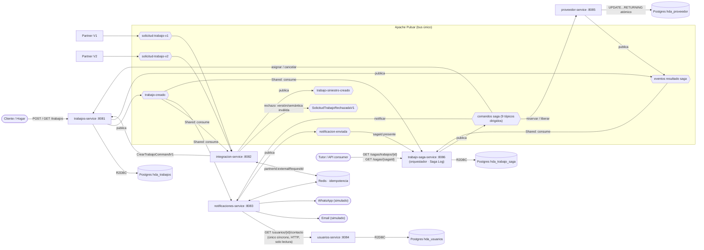

# Hogar de los Alpes — Vistas arquitectónicas actualizadas (post-experimento)

> Complementa la Entrega 2. Los diagramas de esa entrega describían la arquitectura objetivo
> a partir de **supuestos**. El experimento de interoperabilidad B2B2C
> (`docs/experiments/escenario-interoperabilidad-java.md`) y la implementación real hasta la
> Entrega 5 (`README.md`, sección "Saga") forzaron una evolución: se validaron algunas
> decisiones, se refinaron otras y quedaron en pausa las capacidades que el experimento no
> tocó. Esta nota actualiza las tres vistas (contexto, funcional/módulos, componentes y
> conectores) para reflejar esa realidad, y deja explícito qué cambió y por qué frente a cada
> punto de sensibilidad (S1–S9) y de modificabilidad (M1–M7) de la Entrega 2.

## 0. Qué demostró el experimento, en una tabla

| Supuesto de Entrega 2 | Qué pasó en el experimento | Veredicto |
| --- | --- | --- |
| S1: un único motor de orquestación (`Orquestación de trabajos`), coreografía entre el resto de contextos, sin coordinador global | Se implementó un **orquestador dedicado** (`trabajo-saga-service`) con Saga Log explícito para "asignación de trabajo con proveedor". `trabajos-service`, `proveedor-service` y `notificaciones-service` no saben que están en una saga: solo reciben comandos y devuelven eventos | **Refinado, no contradicho**: la orquestación explícita sí existe, pero acotada a UNA transacción larga bien identificada — no es un componente "que todo lo sabe". Coreografía sigue siendo la regla por defecto en el resto |
| S4 / M4: ACL + adaptador (uno por partner) concentran ~70% del volumen; alta de partner = configuración, no código | Se implementó `integracion-service` como ACL genérico con `SolicitudTrabajoPartnerMapper` que traduce **versiones de contrato** (V1/V2) al modelo canónico, no un adaptador por partner físico | **Simplificado**: un solo servicio + mapper versionado basta para el volumen probado; el patrón "un ADP por partner" de Entrega 2 no se materializó — se sustituyó por versionado de esquema |
| "Cero llamados síncronos salientes" en la ruta de negocio | Existe **una única excepción documentada**: `notificaciones-service → usuarios-service` por HTTP GET, de solo lectura | **Matizado**: la regla pasa de absoluta a "por excepción, explícita y acotada a lectura" |
| S2/S3: bus como único medio de integración, partición por `trabajoId`, entrega al-menos-una-vez, comando vs. evento | Fan-out real con suscripción `Shared` de Pulsar: 3 consumidores independientes (`integracion`, `notificaciones`, `trabajo-saga`) sobre el mismo tópico `trabajo-creado`, sin tocarse entre sí | **Confirmado** — evidencia de código de por qué agregar un consumidor nuevo no exige tocar productor ni a los demás consumidores |
| M1/M2: Seedwork como *shared kernel* único + `pl-esquemas` como único acoplamiento | El código real **duplica el Seedwork por servicio** (no es una librería compartida) y dejó *una sola* librería realmente compartida: `eventos-shared` (Avro / Published Language) | **Contradicho en parte**: dos acoplamientos previstos (Seedwork + esquemas) se redujeron a uno solo (esquemas). Cada servicio que modela un agregado lleva su propio Seedwork |
| Reserva de `Proveedor` (Marketplace y asignación) | Verificación de idempotencia (paso 9) encontró una condición de carrera con el patrón cargar-mutar-guardar; se resolvió con `UPDATE ... WHERE disponible = TRUE ... RETURNING` (atómico a nivel SQL) | **Hallazgo nuevo, no anticipado en Entrega 2**: la sensibilidad de "recurso compartido y contendido" no estaba en la tabla original de puntos de sensibilidad |
| Diagnóstico conversacional, Catálogo, Acreditación (verificación externa), Suscripciones, Localización regional, Calidad y reputación, Pagos y liquidación, Fintech (Billetera/Scoring/Cumplimiento), Identidad y acceso, BFFs/API Gateway | **No implementados ni ejercitados** por el experimento | Siguen siendo diseño objetivo de Entrega 2; se marcan como pendientes en las vistas de abajo, no se eliminan |

## 1. Vista de contexto (actualizada)

```mermaid
flowchart LR
    PV1["Partner · contrato V1"]
    PV2["Partner · contrato V2"]
    Cliente(["Hogar / Cliente"])
    Tutor(["Tutor / API consumer"])
    CanalEmail(["Email (simulado)"])
    CanalWA(["WhatsApp (simulado)"])

    subgraph HDA["Hogar de los Alpes — núcleo validado por el experimento"]
        direction LR
        subgraph T1["Organización y habilitación"]
            Trabajos["Gestión de trabajos<br/>(trabajos-service)"]
        end
        subgraph T2["Coordinación y ejecución"]
            Integracion["Integración B2B2C / ACL<br/>(integracion-service)"]
            Saga["Orquestador de asignación<br/>(trabajo-saga-service)"]
            Proveedor["Proveedores<br/>(proveedor-service)"]
        end
        subgraph T3["Cierre y consolidación"]
            Notif["Notificaciones<br/>(notificaciones-service)"]
        end
        Usuarios["Identidad de contacto<br/>(usuarios-service)"]
    end

    subgraph PENDIENTE["Supuestos de Entrega 2 — aún sin validar por el experimento"]
        Diagnostico["Diagnóstico conversacional (IA)"]
        Catalogo["Catálogo de servicios y cobertura"]
        Acreditacion["Acreditación de proveedores<br/>(verificación externa)"]
        Suscripciones["Suscripciones y planes"]
        Localizacion["Localización y cumplimiento regional"]
        Calidad["Calidad y reputación"]
        Pagos["Pagos y liquidación"]
        Fintech["Billetera / Scoring / Cumplimiento financiero"]
        Identidad["Identidad y acceso (OIDC) / BFFs / API Gateway"]
    end

    PV1 -->|"solicitud-trabajo-v1"| Integracion
    PV2 -->|"solicitud-trabajo-v2"| Integracion
    Integracion -->|"CrearTrabajoCommand"| Trabajos
    Cliente -->|"POST /trabajos"| Trabajos
    Trabajos -->|"TrabajoCreado"| Saga
    Saga -->|"ReservarProveedorCommand"| Proveedor
    Saga -->|"Asignar / Cancelar TrabajoCommand"| Trabajos
    Saga -->|"NotificarCommand"| Notif
    Notif -->|"GET contacto (único síncrono)"| Usuarios
    Notif --> CanalEmail
    Notif --> CanalWA
    Tutor -->|"GET /sagas/..."| Saga

    style PENDIENTE fill:#f5f5f5,stroke:#999999,stroke-dasharray: 5 5
```

**Qué cambió frente a la Entrega 2:** el perímetro de "Hogar de los Alpes" no creció ni se
redujo conceptualmente, pero el experimento solo ejercitó una porción — creación de trabajo,
integración con partners (entrante), asignación de proveedor y notificación (saliente). Las
fuentes externas de verificación (Policía Nacional, RUES, certificadoras), pasarelas de pago
(Wompi, Mercado Pago) y proveedores de IA para diagnóstico **no aparecen conectados todavía**
porque ningún servicio real los consume aún; se dejan en el bloque "pendiente" en vez de
borrarlos, porque siguen siendo el diseño objetivo del negocio.

## 2. Vista funcional / de módulos (actualizada)

```mermaid
flowchart TB
    subgraph SharedLib["eventos-shared (Avro · Published Language) — única librería realmente compartida"]
    end

    subgraph Trabajos["trabajos-service"]
        direction TB
        TD["domain/model + domain/usecase<br/>(seedwork propio, NO compartido)"]
        TI["infrastructure: entry-points REST ·<br/>driven-adapters R2DBC + Pulsar"]
        TA["application (composition root)"]
    end
    subgraph Integracion["integracion-service (ACL bidireccional)"]
        direction TB
        ID["domain/usecase: TraducirSolicitudPartner,<br/>TraducirTrabajoCreado"]
        II["infrastructure: pulsar-event-handler,<br/>redis-idempotency"]
        IA["application"]
    end
    subgraph Notificaciones["notificaciones-service"]
        direction TB
        ND["domain: puerto CanalNotificacion<br/>(Email/WhatsApp), ConsultaUsuarioGateway"]
        NI["infrastructure: canal-notificacion,<br/>http-client (único síncrono), redis"]
        NA["application"]
    end
    subgraph Usuarios["usuarios-service"]
        direction TB
        UD["domain/model: Usuario<br/>(seedwork propio)"]
        UI["infrastructure: R2DBC"]
        UA["application"]
    end
    subgraph Proveedor["proveedor-service"]
        direction TB
        PD["domain/model: Proveedor<br/>(reserva atómica UPDATE...RETURNING)"]
        PI["infrastructure: pulsar-command-handler, R2DBC"]
        PA["application"]
    end
    subgraph Saga["trabajo-saga-service (orquestador)"]
        direction TB
        SD["domain/model: SagaTrabajo<br/>(máquina de estados, Saga Log)"]
        SI["infrastructure: 6 listeners,<br/>R2DBC (saga_trabajo / saga_paso)"]
        SA["application"]
    end

    subgraph FUTURO["Bounded contexts de Entrega 2 sin módulo real todavía"]
        F1["Diagnóstico"]
        F2["Catálogo de servicios"]
        F3["Acreditación de proveedores"]
        F4["Marketplace y asignación (matching)"]
        F5["Suscripciones"]
        F6["Localización regional"]
        F7["Calidad y reputación"]
        F8["Pagos y liquidación"]
        F9["Fintech proveedores"]
        F10["Identidad y acceso / BFFs / Gateway"]
    end

    Trabajos -.-> SharedLib
    Integracion -.-> SharedLib
    Notificaciones -.-> SharedLib
    Usuarios -.-> SharedLib
    Proveedor -.-> SharedLib
    Saga -.-> SharedLib

    style FUTURO fill:#f5f5f5,stroke:#999999,stroke-dasharray: 5 5
```

**Qué cambió frente a la Entrega 2:**

- **Seedwork dejó de ser un shared kernel único (M1).** Cada servicio que modela un agregado
  (`trabajos`, `usuarios`, `proveedor`, `trabajo-saga`) trae su propio Seedwork duplicado;
  `integracion` y `notificaciones` no llevan Seedwork porque no modelan un agregado propio. El
  único acoplamiento real entre módulos quedó en `eventos-shared` (M2), no en dos artefactos.
- **Aparece una tercera capa explícita, `application/`**, como composition root/bootable
  module — no estaba modelada como capa propia en la Entrega 2 (que solo mostraba
  Aplicación/Dominio/Infraestructura dentro de cada bounded context).
- **Granularidad reducida**: de las ~15 bounded contexts de la Entrega 2, solo 6 tienen hoy
  un módulo Gradle real y un servicio desplegable. El resto sigue siendo diseño objetivo
  (bloque "futuro"), no descartado.

## 3. Vista de componentes y conectores (actualizada)

**Qué cambió frente a la Entrega 2:**

- **Nuevo componente no previsto: `trabajo-saga-service`.** Materializa la orquestación de
  "asignación de trabajo con proveedor" con Saga Log propio (`saga_trabajo`/`saga_paso`) y
  compensación explícita (`CancelarTrabajoCommand`, `LiberarProveedorCommand`). Es el
  componente que más se aleja de la Entrega 2, que no modelaba ningún orquestador dedicado.
- **`integracion-service` ahora es bidireccional**: además de traducir `trabajo-creado` hacia
  `trabajo-siniestro-creado` (saliente, ya previsto), also actúa como ACL **entrante** para
  contratos de partners versionados (V1/V2), con idempotencia en Redis por
  `partnerId:externalRequestId` y un tópico de rechazo explícito en vez de reintentos
  infinitos.
- **Un único conector síncrono, documentado y acotado a lectura**:
  `notificaciones-service → usuarios-service`. Todo lo demás sigue siendo asíncrono por
  tópicos de Pulsar, confirmando la regla de la Entrega 2 con una excepción controlada.
- **`proveedor-service` reserva con `UPDATE ... WHERE disponible = TRUE ... RETURNING`**, no
  con lectura-mutación-escritura — hallazgo de la verificación de idempotencia (paso 9) que no
  estaba anticipado como punto de sensibilidad en la Entrega 2.
- Persistencia por servicio se confirma (`hda_trabajos`, `hda_usuarios`, `hda_proveedor`,
  `hda_trabajo_saga`); `integracion` y `notificaciones` no tienen base propia, solo Redis.
