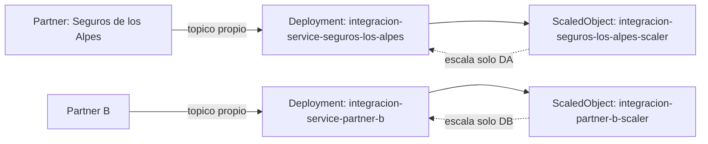

# Escenario de calidad: escalado aislado por partner ante un pico de trafico

## Hipotesis

Ante un evento que dispara un incremento subito (hasta 4x) en las peticiones de un partner
B2B2C, el sistema debe escalar de forma aislada el componente afectado sin degradar a otros
partners ni al marketplace. Un partner sobrecargado no debe consumir la capacidad de otro.

## Alcance implementado

| Elemento | Implementacion |
| --- | --- |
| Aislamiento de tráfico | Cada partner publica en su propio tópico Pulsar (`solicitud-trabajo-seguros-los-alpes`, `solicitud-trabajo-partner-b`), no comparten tópico ni suscripción. |
| Aislamiento de cómputo | Cada partner tiene su propio `Deployment` de `integracion-service` (`integracion-service-seguros-los-alpes`, `integracion-service-partner-b`), activando solo su ACL de entrada (`hda.integracion.inbound-partner.enabled=true`, `hda.integracion.outbound.enabled=false`) — ver `SolicitudTrabajoPartnerListener`. |
| Autoescalado independiente | Un `ScaledObject` de KEDA por partner (`deploy/k8s/autoscaling/30-scaledobjects.yaml`), cada uno con un único trigger Pulsar sobre el backlog de SU propio tópico. El backlog de un partner nunca dispara el escalado del otro. |
| Flujo de salida separado | `integracion-service` (sin sufijo) atiende solo `TrabajoCreadoListener` (trabajo-creado → trabajo-siniestro-creado), con su propio `Deployment`/`ScaledObject` — no compite por réplicas con ningún partner. |
| Configuración por entorno | `PARTNER_CONTRACT_VERSION`, `PARTNER_TOPIC`, `PARTNER_SUBSCRIPTION`, `PARTNER_ID` (env vars) seleccionan qué partner atiende cada instancia del mismo jar — ver `application.yml` de `integracion-service`. |

La topología es la misma en `deploy/k8s` (local/Kind) y `deploy/k8s-cloud` (EKS).



## Como ejecutar la evidencia (k8s local)

Requiere el flujo de `deploy/k8s/README.md` ya desplegado (Kind/minikube + KEDA).

```bash
kubectl get scaledobject -n hda
kubectl get pods -n hda -l app=integracion-service-seguros-los-alpes
kubectl get pods -n hda -l app=integracion-service-partner-b
```

Genera backlog **solo** en el tópico de un partner (simulando su pico de 4x), por ejemplo con el
publicador de demo activado únicamente en esa instancia:

```bash
kubectl set env deployment/integracion-service-seguros-los-alpes -n hda HDA_DEMO_PARTNER_ENABLED=true
kubectl rollout restart deployment/integracion-service-seguros-los-alpes -n hda
```

O publicando varios mensajes directamente al tópico con `pulsar-admin`/un productor de carga.
Mientras el backlog de `solicitud-trabajo-seguros-los-alpes` sube:

```bash
kubectl get scaledobject integracion-seguros-los-alpes-scaler -n hda -o yaml | grep -A3 status
kubectl get pods -n hda -l app=integracion-service-seguros-los-alpes -w
```

Se espera observar que **solo** `integracion-service-seguros-los-alpes` escala (más réplicas),
mientras `integracion-service-partner-b` y `integracion-service` permanecen en su
`minReplicaCount` (1), sin backlog ni degradación.

## Criterio de éxito y límite conocido

El escenario se considera exitoso si, ante backlog en el tópico de un solo partner, únicamente el
`Deployment` de ese partner escala, y el `ScaledObject`/réplicas del otro partner y del flujo de
salida no se ven afectados.

Límite conocido: los tres `Deployment` (`integracion-service`, `integracion-service-seguros-los-alpes`,
`integracion-service-partner-b`) siguen compitiendo por los mismos nodos del cluster
(`node_max_size` en Terraform) — el aislamiento es de réplicas/ScaledObject, no de nodos
dedicados. Para aislamiento a nivel de nodo (p. ej. un partner "ruidoso" saturando CPU/red del
nodo compartido) haría falta `nodeSelector`/taints por partner, fuera del alcance actual.
