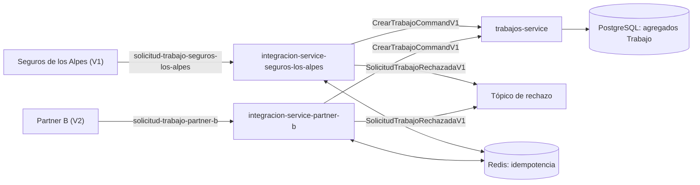

# Escenario de calidad: interoperabilidad de contratos B2B2C

## Hipotesis

Hogar de los Alpes puede recibir solicitudes de asistencia de partners que usan versiones distintas de su contrato sin acoplar el dominio de `trabajos-service` a esos contratos. `integracion-service` actua como capa anticorrupcion (ACL): conserva el vocabulario externo en el borde, lo normaliza a un comando canonico y publica el resultado para que Trabajos lo procese.

## Alcance implementado

| Elemento | Implementacion |
| --- | --- |
| Contratos externos | Avro `SolicitudTrabajoPartnerV1` y `SolicitudTrabajoPartnerV2` en topicos separados **por partner** (no solo por version): `seguros-los-alpes` usa V1, `partner-b` usa V2. V2 reorganiza los mismos datos en objetos anidados. |
| Aislamiento por partner | Cada partner tiene su propia instancia de `integracion-service` (mismo jar, `hda.pulsar.partner.*` distinto por entorno) consumiendo solo su topico — ver escenario de escalabilidad "pico por evento climatico": un partner sobrecargado no consume la capacidad del otro ni del flujo de salida (`hda.integracion.outbound.enabled=false` en las instancias de partner). |
| ACL | `SolicitudTrabajoPartnerMapper` adapta ambas versiones a `SolicitudTrabajoPartner`; `TraducirSolicitudPartnerUseCase` valida y traduce codigos de asistencia, prioridad y ciudad. |
| Contrato interno | Avro `CrearTrabajoCommandV1`, publicado en `persistent://hda/trabajos/crear-trabajo-command`. |
| Consumidor de destino | `CrearTrabajoCommandListener` en `trabajos-service`, que convierte el comando canonico al caso de uso existente y crea el agregado `Trabajo`. |
| Version invalida/semantica invalida | Se confirma el mensaje y se publica `SolicitudTrabajoRechazadaV1` con `correlationId`, version, motivo y solicitud original; asi se evita reintentos infinitos por errores no transitorios. |
| Duplicados | `integracion-service` usa Redis con la clave `partnerId:externalRequestId`; una solicitud ya procesada no vuelve a originar un comando. |

La topologia es asincrona y basada en comandos/eventos: un partner no llama directamente a Trabajos ni conoce su modelo de dominio.



Cada instancia (`integracion-service-seguros-los-alpes`, `integracion-service-partner-b`) es el mismo jar, escuchando solo su propio topico/version — no hay ninguna instancia que conozca ambos contratos a la vez. Eso es lo que le permite a cada partner escalar de forma aislada (ver `deploy/k8s/autoscaling/30-scaledobjects.yaml`: un `ScaledObject` por partner, cada uno con un unico trigger sobre su propio topico).

## Como ejecutar la evidencia local

Desde la raiz del repositorio:

```bash
cd deploy/docker-compose
HDA_DEMO_PARTNER_ENABLED=true docker compose up -d --build
docker compose logs --follow integracion-service-seguros-los-alpes integracion-service-partner-b trabajos-service
```

`HDA_DEMO_PARTNER_ENABLED=true` activa `PartnerContractDemoPublisher` en **ambas** instancias de partner (cada una publica una unica solicitud, con el contrato y hacia el topico que ella misma consume): `integracion-service-seguros-los-alpes` emite una V1 (`PLUMBING`, `P1`, `BOG`), `integracion-service-partner-b` emite una V2 (`ELECTRICAL`, `P2`, `MDE`). En los logs debe observarse que cada instancia consume solo la suya y que Trabajos procesa ambos comandos resultantes.

Para verificar que los dos contratos llegaron y que Trabajos persistio los agregados:

```bash
docker compose exec pulsar bin/pulsar-admin topics stats persistent://hda/partner/solicitud-trabajo-seguros-los-alpes
docker compose exec pulsar bin/pulsar-admin topics stats persistent://hda/partner/solicitud-trabajo-partner-b
docker compose exec postgres psql -U hda -d hda_trabajos -c 'SELECT id, categoria_servicio, urgencia, ciudad, origen FROM trabajo ORDER BY fecha_creacion DESC LIMIT 5;'
```

Para volver a una ejecucion normal, apague el entorno y levantelo sin `HDA_DEMO_PARTNER_ENABLED=true`:

```bash
docker compose down
docker compose up -d --build
```

## Evidencia automatizada

Los tests de `SolicitudTrabajoPartnerMapperTest` prueban que V1 y V2 con el mismo significado se convierten al mismo modelo interno. `TraducirSolicitudPartnerUseCaseTest` prueba las traducciones y el rechazo de codigos no soportados:

```bash
JAVA_HOME=/opt/homebrew/opt/openjdk@25 PATH=/opt/homebrew/opt/openjdk@25/bin:$PATH \
  backend/gradlew -p backend :integracion-usecase:test :integracion-pulsar-event-handler:test
```

## Criterio de exito y limite conocido

El escenario se considera exitoso si cada version externa se consume, se traduce al contrato canonico y da lugar a un agregado `Trabajo`, sin que `trabajos-service` importe contratos de partners V1/V2. Un contrato con codigos no soportados debe terminar como evento de rechazo trazable, no como reintento infinito.

La idempotencia actual protege duplicados en el borde de Integracion. Para garantizar entrega atomica entre persistencia y publicacion ante una caida de infraestructura, el siguiente refinamiento es implementar un **outbox transaccional** en el servicio que persiste el agregado.
